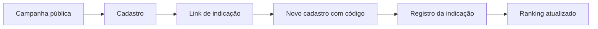

# E3D Campaigns

Plataforma SaaS em desenvolvimento para gestão de campanhas de indicação, participantes, prêmios e ranking.

**Portfólio público · Estado funcional documentado: Sprint 2C · English summary below**

> Esta edição contém documentação e estrutura de publicação. O código-fonte original não estava disponível para exportação; `apps/api` e `apps/web` são diretórios reservados, sem implementação. As funcionalidades abaixo foram relatadas e validadas no histórico de desenvolvimento, não executadas neste pacote.

## Visão do produto

O administrador configura uma campanha, define regras e prêmios e acompanha participantes e indicações. O participante acessa a página pública, realiza o cadastro, recebe um link de indicação e acompanha o ranking. O projeto explora o ciclo completo entre interface, API, persistência e implantação em containers.

## Para recrutadores

- **Domínio:** campanhas com ciclo de vida, regras de participação e relações de indicação.
- **Integração:** painel administrativo e experiência pública conectados ao backend.
- **Investigação de falhas:** rastreamento do código de indicação no payload até a atualização do ranking.
- **Evolução incremental:** entregas por sprints, validação manual e registro de limitações.

Stack descrita no desenvolvimento: **TypeScript, NestJS, Next.js, PostgreSQL, Prisma, Redis, Docker e Coolify**. A função específica do Redis e as versões das dependências precisam ser conferidas quando o código for incorporado.

## Estado documentado

| Área | Evidência disponível |
| --- | --- |
| Autenticação e organizações | Relatadas como implementadas; sem auditoria de isolamento nesta edição |
| Painel e criação de campanhas | Sprint 2A validada manualmente no histórico |
| Edição, regras, prêmios, status e duplicação | Sprint 2B validada manualmente no histórico |
| Página pública, cadastro, link de indicação e ranking | Sprint 2C validada manualmente de ponta a ponta |
| Validade temporal e antifraude | Próxima etapa; `minValidityHours` ainda não efetivo |

O reteste registrado da Sprint 2C terminou com três participantes, uma indicação e pontuação 1 para o indicador. Um teste anterior ficou inconclusivo. Não há resultados de testes automatizados, benchmark ou auditoria de segurança neste pacote.

## Fluxo público



## Interface

Os painéis abaixo são placeholders editoriais, não capturas do sistema.


[Referências para as quatro capturas](docs/screenshots/README.md).

## Navegação

- [Arquitetura e decisões](docs/architecture.md)
- [Estado, evidências e limites](docs/project-status.md)
- [Roadmap](ROADMAP.md)
- [Incorporar o código e preparar execução](docs/source-import.md)
- [Publicar e atualizar com segurança](docs/publication-guide.md)
- [Relatório desta edição](docs/sanitization-report.md)
- [Segurança](SECURITY.md) · [Contribuições](CONTRIBUTING.md) · [Direitos](LICENSE)

```text
apps/api/              reservado para a API original revisada
apps/web/              reservado para o frontend original revisado
docs/                  arquitetura, evidências e publicação
docs/screenshots/      placeholders e roteiro de capturas
.env.example           campos ilustrativos vazios
```

## Execução

Esta edição documental não inicia a aplicação. Não contém manifests, lockfiles, migrations ou Dockerfiles recuperados. O guia de importação descreve o que deve acompanhar o código antes de publicar instruções de instalação verificadas.

## English summary

E3D Campaigns is an evolving referral campaign SaaS project. The documented stack uses TypeScript, NestJS, Next.js, PostgreSQL, Prisma, Redis, Docker and Coolify. The development history reports manual validation of campaign management, public registration, referral links and ranking through Sprint 2C.

This release is a **documentation-only portfolio scaffold**. Original source files were unavailable for export; the API and web directories contain placeholders. No application build or automated tests were run. Referral validity windows and antifraud controls remain planned work. See the architecture, roadmap and publication guide for scope and future updates.

## Direitos

Disponibilizado para apresentação profissional, com reserva de direitos e sem licença ampla de reutilização. Consulte [LICENSE](LICENSE) e [NOTICE](NOTICE). A publicação no GitHub está sujeita aos direitos previstos nos termos da plataforma, inclusive visualização e fork.
