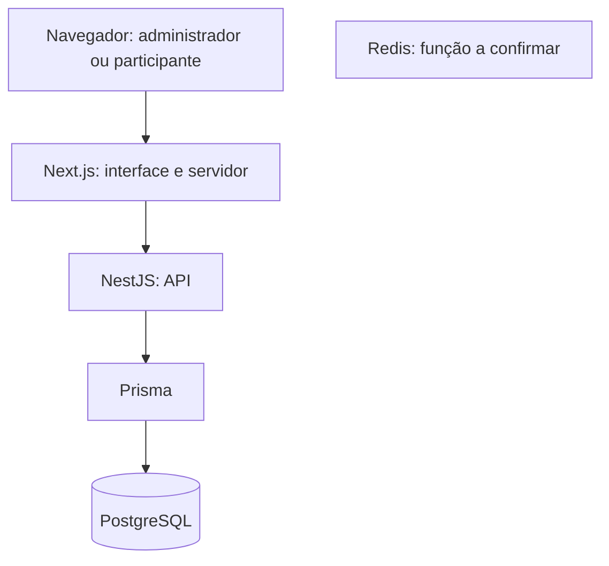

# Arquitetura

Visão lógica baseada no histórico, não em inspeção do código. Nomes de serviços, contratos, dependências e fronteiras de segurança devem ser confirmados na importação.

Redis está listado na stack, sem vínculo de execução presumido no diagrama. Docker e Coolify compõem a infraestrutura descrita; endereços, hosts e configurações de produção foram omitidos.

## Responsabilidades

| Componente | Responsabilidade descrita |
| --- | --- |
| Next.js | Painel administrativo, página pública e encaminhamento do formulário público à API pelo servidor |
| NestJS | Regras de campanhas, cadastro, indicação e consultas de ranking |
| Prisma / PostgreSQL | Persistência relacional; schema e constraints pendentes de inspeção |
| Redis | Presente na stack; não há evidência suficiente para afirmar cache, filas ou sessões |

## Modelo de domínio conceitual

Uma organização reúne campanhas. Uma campanha reúne participantes, regras e prêmios. Uma indicação relaciona um participante indicador a um indicado dentro da campanha. O ranking apresenta a pontuação. Essa descrição não substitui o schema Prisma e não afirma cardinalidades ou constraints físicas verificadas.

## Decisões registradas

1. **Frontend e API separados:** permite evoluir a experiência pública e as regras do domínio em camadas distintas; exige manter contratos consistentes.
2. **Formulário público via servidor Next.js:** na Sprint 2C, a comunicação com a API foi movida para a rede interna dos containers, reduzindo dependência de URL da API no navegador e problemas de CORS. Isso não elimina a necessidade de autenticação, autorização e validação no backend.
3. **Entrega incremental:** painel mínimo, gestão completa e fluxo público foram tratados em sprints separadas, com validação manual entre entregas.

## Regras e limites

O histórico descreve validação de status ativo, período de inscrição, limite de participantes, código de indicação e limite de indicações. Rotas públicas mencionadas: `/c/:slug` e `/r/:code`. Não são contratos completos da API.

O isolamento entre organizações não foi auditado nesta edição. A presença de configurações de validade não significa antifraude implementado: `minValidityHours`, estados pendentes e contagem apenas de indicações válidas são trabalho futuro.
