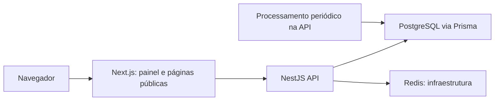

# Arquitetura

```mermaid
flowchart LR
  B[Navegador] --> W[Next.js: painel e páginas públicas]
  W --> A[NestJS API]
  A --> P[PostgreSQL via Prisma]
  A --> R[Redis: infraestrutura]
  S[Processamento periódico na API] --> P
```

O frontend encaminha operações autenticadas para a API; a API aplica permissões e limites de organização. JWT não é a única fonte de autorização: vínculo e perfil atuais são consultados no banco. ANALYST consulta; OWNER/ADMIN/MANAGER administram os recursos existentes.

Campanhas e auditoria administrativa usam transações Serializable com bloqueio da campanha e tentativas limitadas em conflitos. Revisão/reavaliação possui controle de versão e histórico. Ranking conta indicações VALID, sem pontuar cliques.

Links canônicos identificam campanha/participante globalmente; aliases legados só resolvem quando inequívocos. Cliques usam ticket assinado e evento idempotente, com limites persistidos. Essa métrica não identifica humanos únicos.

O agendamento da 3I usa ciclos na inicialização e a cada 30 segundos, até 100 campanhas por lote, com revalidação transacional. Janela vencida resulta em pausa. Não há finalização automática nem congelamento de ranking. UTC é usado para instantes; UTC−3 fixo para exibição e edição.
